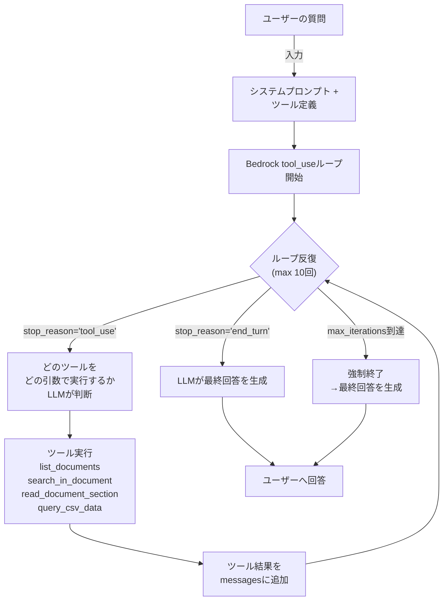

> **このシリーズ: 全3回**
> 1. [第1回: エージェントループ設計編](/posts/agentic-rag-without-vector-search-part1) ← 今ここ
> 2. [第2回: 検索エンジン編](/posts/agentic-rag-without-vector-search-part2)
> 3. [第3回: リアルタイム進捗配信編](/posts/agentic-rag-without-vector-search-part3)

## はじめに

大規模言語モデル（LLM）を使った質問応答システムを構築する際、**従来のRAG**は以下のパイプラインが一般的です。

1. ユーザーのクエリをベクトル化
2. ベクトルDBから類似度でTop-K件のドキュメント取得
3. 取得したテキストをLLMに渡して回答生成

この方法は高速ですが、**致命的な弱点**があります：

- **埋め込みベクトル化の限界**: 同義語や意味の複雑な関係を捉え切れず、関連ドキュメントを落とす
- **ハルシネーション**: 不完全な検索結果から、LLMが根拠のない情報を生成
- **一度きりの検索**: クエリに対して最初の一発の検索しかせず、追加情報の必要性に気づかない

では、**もし人間の研究者のように、LLMが自分で複数回ドキュメントを閲覧し、必要に応じて検索戦略を変えたら？**

このアプローチを **エージェンティック検索（Agentic Search）** と呼び、本シリーズではその実装を徹底解説します。

---

## こんな人向け

このシリーズは以下のような方を想定しています：

- RAGシステムを構築していて、ベクトル検索の精度に不満がある
- LLMのエージェント実装に興味がある
- FastAPI + AWS Bedrock での実装パターンを学びたい
-「とにかく動く」だけでなく、本番運用に耐える設計を知りたい

---

## 前提条件

本記事で扱う実装は以下の環境を前提としています：

- **LLM**: AWS Bedrock（Claude 3 Sonnet以上推奨）
- **フレームワーク**: FastAPI（Python 3.11以上）
- **データ格納**: ファイルシステム + DuckDB（CSV検索時）
- **メッセージフロー**: tool_useループ対応のLLM

AWS Bedrockの基本的な使い方と、FastAPIでの非同期処理に関する最小限の知識があるとスムーズです。

---

## 従来のRAGとエージェンティック検索の比較

実装に入る前に、アーキテクチャの差異を整理します。

| 項目 | 従来的なRAG | エージェンティック検索 |
|------|------------|----------------------|
| **検索方法** | クエリ→埋め込みベクトル化→ベクトルDB→Top-K取得 | LLMが「どの情報が必要か」判断→ツール実行→結果を評価→次のアクション決定 |
| **クエリ前処理** | 固定（あっても同義語展開程度） | LLMが動的に検索戦略を変更 |
| **ドキュメント取得** | ランキング（確定的） | エージェントループ（探索的） |
| **ドキュメント読み込み** | 全文ではなくチャンク（断片） | 必要な範囲だけピンポイント読み込み |
| **反復試行** | 1回 | 複数回（LLM判断で終了） |
| **インフラ要件** | ベクトルDB必須 | 不要（ファイルシステム + キーワード検索エンジン） |
| **レスポンス精度** | 検索品質に依存 | LLMが自律的に情報を補填 |
| **レスポンス遅延** | 短（ビジネスロジック後処理は別） | 長（複数ラウンドのLLM呼び出し） |

エージェンティック検索は**精度**と**自律性**を優先し、遅延と計算コストは増加します。

---

## エージェンティック検索のアーキテクチャ

### 全体像



### 3つのコアツール設計

エージェントに与える3つのツールの定義を見ていきます。

#### 1. `list_documents` — ドキュメント一覧取得

```python
{
    "name": "list_documents",
    "description": "利用可能なすべてのドキュメント一覧を取得します。ドキュメントID、ファイル名、文字数が返されます。このツールは引数を取りません。エージェンティック検索を開始する際は、このツールを必ず最初に呼び出してください。",
    "input_schema": {
        "type": "object",
        "properties": {},
        "required": []
    }
}
```

**LLMの使用パターン**:
- 最初のループで自動的に呼び出す
- ドキュメント全体を把握する
- その後、どの文書を探索すべきか判断する

**返却例**:
```json
{
    "documents": [
        {"id": "doc_001", "filename": "AWS_Bedrock_Guide.pdf", "char_count": 45230},
        {"id": "doc_002", "filename": "FastAPI_Best_Practices.md", "char_count": 18900},
        {"id": "doc_003", "filename": "Company_Policy_2024.pdf", "char_count": 67500}
    ],
    "total": 3
}
```

#### 2. `search_in_document` — キーワード検索

```python
{
    "name": "search_in_document",
    "description": "特定のドキュメント内でキーワード検索を実行します。複数のキーワードはスペース区切りで指定し、AND検索（すべてのキーワードを含む行）を実行します。検索結果は前後10行のコンテキスト付きで返されます。",
    "input_schema": {
        "type": "object",
        "properties": {
            "document_id": {
                "type": "string",
                "description": "検索対象のドキュメントID（例：doc_001）"
            },
            "keywords": {
                "type": "string",
                "description": "検索キーワード。複数キーワードはスペース区切り（AND検索）。例：'authentication token'"
            }
        },
        "required": ["document_id", "keywords"]
    }
}
```

**LLMの使用パターン**:
- 質問に関連するキーワード群を考える
- 各ドキュメントで段階的に検索
- マッチする行を見つけたら、その行付近を深掘り

**返却例**:
```json
{
    "matches": [
        {
            "line_number": 245,
            "line": "Bedrock APIは認証にAWS SigV4を使用しており、IAMロールベースのアクセス制御をサポートしています。",
            "offset": 8934,
            "context_before": ["AWS Bedrockのセキュリティ実装", "第3章 認証とアクセス制御", ""],
            "context_after": ["詳細はAWS公式ドキュメントを参照。", ""]
        }
    ],
    "total_matches": 5
}
```

#### 3. `read_document_section` — 範囲読み込み

```python
{
    "name": "read_document_section",
    "description": "ドキュメントの特定範囲（文字オフセット）を読み込みます。検索で見つけたマッチ箇所や、特定の章を詳しく読む際に使用します。最大30,000文字まで一度に読み込めます。",
    "input_schema": {
        "type": "object",
        "properties": {
            "document_id": {
                "type": "string",
                "description": "読み込み対象のドキュメントID"
            },
            "offset": {
                "type": "integer",
                "description": "読み込み開始位置（文字オフセット）"
            },
            "length": {
                "type": "integer",
                "description": "読み込む文字数。最大30000。"
            }
        },
        "required": ["document_id", "offset", "length"]
    }
}
```

**LLMの使用パターン**:
- 検索でマッチした行の周辺を詳しく読む
- 必要に応じて前後の文脈を拡大
- 複数の断片を組み合わせて全体像を把握

---

### オプショナルツール: `query_csv_data`

CSVやエクセルなどの**データソース**がアップロードされている場合、動的に追加されるツール。

```python
{
    "name": "query_csv_data",
    "description": "CSVデータソースに対してSQL検索を実行します。mode='describe'でスキーマと先頭5行を表示、mode='query'でSQLクエリを実行します。",
    "input_schema": {
        "type": "object",
        "properties": {
            "source_id": {
                "type": "string",
                "description": "データソースID（例：datasource:sales_2024）"
            },
            "mode": {
                "type": "string",
                "enum": ["describe", "query"],
                "description": "describe: スキーマ表示 / query: SQLクエリ実行"
            },
            "query": {
                "type": "string",
                "description": "mode='query'時のSQLクエリ。DuckDB方言。"
            }
        },
        "required": ["source_id", "mode"]
    }
}
```

---

## ツール使用ループの実装

それでは、Bedrock Clientを使ったエージェントループの実装を見てみましょう。

### ループの骨組み

```python
async def chat_with_agent(
    user_query: str,
    system_prompt: str,
    agentic_tools: list[dict],
    bedrock_client: BedrockClient,
    max_iterations: int = 10,
) -> str:
    """
    エージェンティック検索を実行し、最終回答を返す。

    Args:
        user_query: ユーザーの質問
        system_prompt: システムプロンプト
        agentic_tools: ツール定義リスト
        bedrock_client: Bedrock非同期クライアント
        max_iterations: 最大ループ回数

    Returns:
        最終回答テキスト
    """
    messages: list[dict] = [
        {"role": "user", "content": user_query}
    ]

    for iteration in range(1, max_iterations + 1):
        print(f"[Iteration {iteration}]")

        # Bedrockにクエリを送信
        response = await bedrock_client.generate_with_tools(
            messages=messages,
            system_prompt=system_prompt,
            tools=agentic_tools,
            max_tokens=4096,
            temperature=0.3,
        )

        # stop_reasonに基づいて処理を分岐
        if response.stop_reason == "end_turn":
            # LLMが回答を生成し終わった
            print("LLMが回答を生成しました（終了）")
            final_answer = extract_text_from_content(response.content)
            return final_answer

        if response.stop_reason == "tool_use":
            # ツール呼び出しが必要
            print(f"ツール呼び出しが要求されました")

            # LLMのレスポンス全体をmessagesに追加
            messages.append({
                "role": "assistant",
                "content": response.content_raw
            })

            # ツール実行結果を格納
            tool_results = []
            for block in response.content:
                if isinstance(block, bedrock_client.ToolUseBlock):
                    tool_name = block.name
                    tool_input = block.input

                    print(f"  → {tool_name} 実行中...")

                    # ツールハンドラーを選択・実行
                    try:
                        result_text = await dispatch_tool(
                            tool_name,
                            tool_input,
                            # その他の引数（ドキュメントリポジトリ等）
                        )
                    except Exception as e:
                        result_text = f"ツール実行エラー: {str(e)}"

                    # 実行結果をtool_result形式で追加
                    tool_results.append({
                        "type": "tool_result",
                        "tool_use_id": block.id,
                        "content": [{"type": "text", "text": result_text}],
                    })

            # ツール結果をmessagesに追加
            messages.append({
                "role": "user",
                "content": tool_results
            })

            continue

    # max_iterations に到達した場合：強制終了処理
    print("最大イテレーション数に到達しました。最終回答を生成します...")
    messages.append({
        "role": "user",
        "content": [
            {
                "type": "text",
                "text": "これまでに読み込んだドキュメント内容を踏まえて、質問に対する最終的な回答を生成してください。"
            }
        ]
    })

    response = await bedrock_client.generate_with_tools(
        messages=messages,
        system_prompt=system_prompt,
        tools=agentic_tools,
        max_tokens=4096,
        temperature=0.3,
    )

    final_answer = extract_text_from_content(response.content)
    return final_answer
```

### ツールディスパッチャーの実装

各ツール呼び出しを適切なハンドラーにルーティング。

```python
async def dispatch_tool(
    tool_name: str,
    tool_input: dict,
    doc_repository: DocumentRepository,
    csv_processor: CsvDataProcessor,
) -> str:
    """
    ツール名に基づいて適切なハンドラーを実行する。
    """
    if tool_name == "list_documents":
        return await handle_list_documents(doc_repository)

    elif tool_name == "search_in_document":
        document_id = tool_input.get("document_id")
        keywords = tool_input.get("keywords")
        return await handle_search_in_document(
            document_id, keywords, doc_repository
        )

    elif tool_name == "read_document_section":
        document_id = tool_input.get("document_id")
        offset = tool_input.get("offset")
        length = tool_input.get("length")
        return await handle_read_document_section(
            document_id, offset, length, doc_repository
        )

    elif tool_name == "query_csv_data":
        source_id = tool_input.get("source_id")
        mode = tool_input.get("mode")
        query = tool_input.get("query")
        return await handle_query_csv_data(
            source_id, mode, query, csv_processor
        )

    else:
        return f"未知のツール: {tool_name}"
```

### ツール実装の例：`list_documents`

```python
async def handle_list_documents(
    doc_repository: DocumentRepository,
) -> str:
    """
    利用可能なすべてのドキュメントを一覧表示。
    """
    documents = await doc_repository.list_all()

    # レスポンスをJSON形式で返す
    response_data = {
        "documents": [
            {
                "id": doc.id,
                "filename": doc.filename,
                "char_count": len(doc.content)
            }
            for doc in documents
        ],
        "total": len(documents)
    }

    return json.dumps(response_data, ensure_ascii=False, indent=2)
```

### ツール実装の例：`search_in_document`

```python
async def handle_search_in_document(
    document_id: str,
    keywords: str,
    doc_repository: DocumentRepository,
) -> str:
    """
    ドキュメント内でキーワード検索を実行。
    複数キーワードはAND検索。
    """
    document = await doc_repository.get_by_id(document_id)
    if not document:
        return f"ドキュメントが見つかりません: {document_id}"

    # キーワードをスペース分割
    keyword_list = keywords.strip().split()

    # 行ごとにマッチ判定
    lines = document.content.split("\n")
    matches = []

    for line_idx, line in enumerate(lines):
        # すべてのキーワードが含まれているか（AND検索）
        if all(kw.lower() in line.lower() for kw in keyword_list):
            # 文字オフセットを計算
            offset = sum(len(l) + 1 for l in lines[:line_idx])

            # 前後10行を取得
            context_before = lines[max(0, line_idx - 10):line_idx]
            context_after = lines[line_idx + 1:min(len(lines), line_idx + 11)]

            matches.append({
                "line_number": line_idx + 1,
                "line": line,
                "offset": offset,
                "context_before": context_before,
                "context_after": context_after,
            })

    response_data = {
        "matches": matches,
        "total_matches": len(matches)
    }

    return json.dumps(response_data, ensure_ascii=False, indent=2)
```

### ツール実装の例：`read_document_section`

```python
async def handle_read_document_section(
    document_id: str,
    offset: int,
    length: int,
    doc_repository: DocumentRepository,
) -> str:
    """
    ドキュメントの指定範囲を読み込む。
    """
    document = await doc_repository.get_by_id(document_id)
    if not document:
        return f"ドキュメントが見つかりません: {document_id}"

    # オフセットと長さで範囲を抽出
    content = document.content[offset:offset + length]

    return content
```

---

## 動的ツールリストの構築

データソースのタイプに応じて、ツールリストを動的に構築します。

```python
async def build_agentic_tools(
    knowledge_base_id: str,
    db: AsyncSession,
) -> tuple[list[dict], str]:
    """
    ナレッジベースの構成に基づいて、ツール定義と
    システムプロンプトサフィックスを構築する。

    Returns:
        (ツール定義リスト, システムプロンプトサフィックス)
    """
    tools = [
        {
            "name": "list_documents",
            "description": "利用可能なすべてのドキュメント一覧を取得します...",
            "input_schema": { ... }
        },
        {
            "name": "search_in_document",
            "description": "特定のドキュメント内でキーワード検索を実行します...",
            "input_schema": { ... }
        },
        {
            "name": "read_document_section",
            "description": "ドキュメントの特定範囲を読み込みます...",
            "input_schema": { ... }
        },
    ]

    system_prompt_suffix = ""

    # データソースが存在するか確認
    stmt = select(DataSource).where(
        DataSource.knowledge_base_id == knowledge_base_id,
        DataSource.source_type == "data"
    )
    data_sources = (await db.execute(stmt)).scalars().all()

    # データソースが存在する場合、query_csv_dataツールを追加
    if data_sources:
        tools.append({
            "name": "query_csv_data",
            "description": "CSVデータソースに対してSQL検索を実行します...",
            "input_schema": { ... }
        })

        system_prompt_suffix += (
            "\n\n## データソース\n"
            "以下のCSVデータソースが利用可能です：\n"
        )
        for ds in data_sources:
            system_prompt_suffix += f"- {ds.id}: {ds.filename}\n"

        system_prompt_suffix += (
            "\nデータソースのクエリ前に、mode='describe'で"
            "スキーマを確認することを強く推奨します。\n"
        )

    return tools, system_prompt_suffix
```

---

## システムプロンプトの設計

エージェントの振る舞いを制御するシステムプロンプトは、次のセクションで構成します：

```python
SYSTEM_PROMPT_TEMPLATE = """
あなたは優秀なドキュメント検索エージェントです。
ユーザーの質問に対して、提供されたツールを使用して
ドキュメントを探索し、正確で根拠のある回答を生成してください。

## 指示

1. **初期探索**: 最初は必ず list_documents を呼び出して、
   利用可能なドキュメント一覧を把握してください。

2. **検索戦略**:
   - ユーザーの質問から重要なキーワードを抽出
   - 関連すると思われるドキュメントで search_in_document を実行
   - マッチする行が見つかったら、周辺コンテキストを読み込むため
     read_document_section を使用

3. **自己修正**:
   - 初期検索でマッチがない場合は、キーワードを変更して再検索
   - 複数のキーワード組み合わせを試す（AND/OR戦略）
   - 別のドキュメントも探索

4. **情報統合**:
   - 複数ドキュメントから収集した情報を総合化
   - 矛盾がある場合は明記

5. **回答生成**:
   - 十分な根拠が揃ったら、最終的な回答を生成してください
   - 引用元ドキュメント名を明示してください
   - 不確実な情報は「〜だと考えられます」と表現

{additional_instructions}

## 注意

- ツール呼び出しは1ループで複数回実行できません
- 各ループでは1つのツールのみ呼び出してください
- 最大10回のイテレーションで完了してください
"""

def build_system_prompt(
    additional_instructions: str = "",
    data_source_info: str = "",
) -> str:
    """システムプロンプトを構築する"""
    full_instructions = additional_instructions
    if data_source_info:
        full_instructions += "\n" + data_source_info

    return SYSTEM_PROMPT_TEMPLATE.format(
        additional_instructions=full_instructions
    )
```

---

## エラー処理とグレースフルデグラデーション

実運用では、様々なエラーが起こります。

### Max Iterations 到達時の処理

```python
async def handle_max_iterations_exceeded(
    messages: list[dict],
    bedrock_client: BedrockClient,
    system_prompt: str,
) -> str:
    """
    最大イテレーション数に到達した場合、
    ここまで取得した情報で最終回答を生成する。
    """
    # 強制的に回答生成を促す指示を追加
    messages.append({
        "role": "user",
        "content": [
            {
                "type": "text",
                "text": (
                    "検索ループが終了しました。"
                    "これまでに読み込んだドキュメント内容を踏まえて、"
                    "ユーザーの質問に対する最終的な回答を生成してください。"
                ),
            }
        ]
    })

    # 最後のLLM呼び出し（ツール定義なし）
    response = await bedrock_client.generate(
        messages=messages,
        system_prompt=system_prompt,
        max_tokens=2048,
        temperature=0.3,
    )

    return extract_text_from_content(response.content)
```

### ツール実行エラーハンドリング

```python
async def dispatch_tool_with_error_handling(
    tool_name: str,
    tool_input: dict,
    # その他の引数
) -> str:
    """
    ツール実行時のエラーをキャッチし、
    LLMが次のアクションを判断できるメッセージを返す。
    """
    try:
        if tool_name == "list_documents":
            return await handle_list_documents(...)
        # その他のツール
    except ValueError as e:
        # バリデーションエラー
        return f"入力エラー: {str(e)}"
    except FileNotFoundError as e:
        return f"ドキュメント検索エラー: {str(e)}"
    except Exception as e:
        # 予期しないエラー
        return f"ツール実行エラー: {type(e).__name__} - {str(e)}"
```

---

## ポイントと注意点

### 1. **ツール出力形式の重要性**

LLMがツール結果を正しく解析できるよう、JSON形式で返すことが重要です。

良い例：
```json
{
  "matches": [...],
  "total_matches": 5
}
```

悪い例：
```
マッチした行：
...
...
（テキスト形式で羅列）
```

### 2. **stop_reason の正しい判定**

AWS Bedrock の Claude モデルの `stop_reason` には複数の値があります：

- `"end_turn"`: LLMが通常の終了を判定（回答生成完了）
- `"tool_use"`: ツール呼び出しが必要
- `"max_tokens"`: max_tokensに到達（不完全な応答）

`max_tokens` に到達した場合は、さらに続きを生成するか、グレースフルに終了するかの判断が必要です。

### 3. **イテレーション回数の調整**

- **少なすぎる（3回以下）**: 十分に探索できず、不完全な回答になる可能性
- **適度（5～10回）**: ほとんどのユースケースに対応
- **多すぎる（15回以上）**: コスト増加、レスポンス遅延

ナレッジベースのサイズと複雑性に応じて調整してください。

### 4. **キーワード検索の戦略**

AND検索のみでは誤検出も漏れも防げません。後続の第2回で「検索エンジン編」として、OR フォールバック戦略を詳しく解説します。

### 5. **ツール結果の文字数制限**

ツール結果が大きすぎるとLLMのコンテキストを圧迫します。`read_document_section` の 30,000文字制限は、この理由から設定されています。

---

## バイブコーディングで実装する

それでは、実際の利用シーンを想定したプロンプト例を示します。

### シナリオ：「AWS Bedrockのセキュリティベストプラクティスは？」

```python
import asyncio
from your_app.agent import chat_with_agent
from your_app.bedrock_client import BedrockClient
from your_app.repositories import DocumentRepository

async def main():
    # 初期化
    bedrock = BedrockClient(
        region="us-east-1",
        model_id="anthropic.claude-3-sonnet-20240229-v1:0"
    )
    doc_repo = DocumentRepository()

    # ツール定義の構築
    tools, data_suffix = await build_agentic_tools(
        knowledge_base_id="kb_prod_001",
        db=async_session,
    )

    # システムプロンプトの構築
    system_prompt = build_system_prompt(
        additional_instructions=(
            "AWS Bedrockに関するセキュリティガイドを検索する際は、"
            "IAM、暗号化、API認証に関するキーワードを重点的に探索してください。"
        ),
        data_source_info=data_suffix,
    )

    # ユーザーの質問
    user_query = "AWS Bedrock使用時のセキュリティベストプラクティスを教えてください"

    # エージェンティック検索を実行
    final_answer = await chat_with_agent(
        user_query=user_query,
        system_prompt=system_prompt,
        agentic_tools=tools,
        bedrock_client=bedrock,
        max_iterations=10,
    )

    print("=== 最終回答 ===")
    print(final_answer)

if __name__ == "__main__":
    asyncio.run(main())
```

### 期待される実行フロー

```
[Iteration 1]
ツール呼び出しが要求されました
  → list_documents 実行中...
結果: 15個のドキュメントが利用可能

[Iteration 2]
ツール呼び出しが要求されました
  → search_in_document 実行中...
    document_id: doc_004
    keywords: "AWS Bedrock IAM 認証"
結果: 3件のマッチ

[Iteration 3]
ツール呼び出しが要求されました
  → read_document_section 実行中...
    document_id: doc_004
    offset: 2450
    length: 5000
結果: IAM設定に関する詳細テキスト取得

[Iteration 4]
ツール呼び出しが要求されました
  → search_in_document 実行中...
    document_id: doc_007
    keywords: "暗号化 KMS データ保護"
結果: 2件のマッチ

[Iteration 5]
LLMが回答を生成しました（終了）

=== 最終回答 ===
AWS Bedrock使用時のセキュリティベストプラクティスは以下の通りです：

1. **IAM認証と最小権限の原則**
   （doc_004より）AWS BedrockはネイティブにIAMロールベースのアクセス制御をサポートしており...

2. **データの暗号化**
   （doc_007より）転送中はTLS 1.2以上、保存時はAWS KMSで暗号化を実施...

3. **API監査ログ**
   （doc_009より）CloudTrailで全APIコールを記録し、監視体制を構築...
```

---

## まとめ

本記事では、エージェンティック検索の基本設計と実装パターンを解説しました。

**重要なポイント**：

1. **3つのコアツール**（list, search, read）でLLMに自律的な探索を可能に
2. **tool_useループ**で「何をすべきか」をLLMに判断させる
3. **動的ツール構築**でナレッジベースの構成に適応
4. **グレースフルデグラデーション**で不完全な状態も回答を生成

ベクトル検索の限界を超え、LLMの推論能力を最大限に活用するアーキテクチャです。

---

次回: [第2回: 検索エンジン編](/posts/agentic-rag-without-vector-search-part2) では、スライディングウィンドウAND検索とORフォールバックの実装、LLMに検索戦略を自己修正させるシステムプロンプト設計を解説します。
